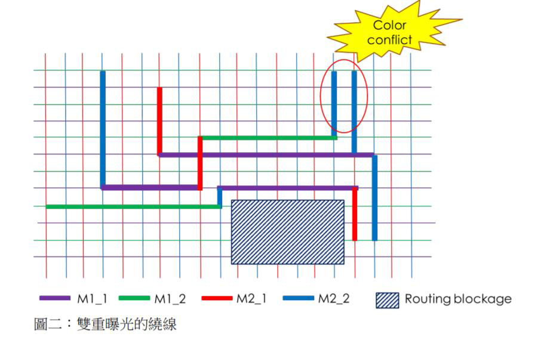
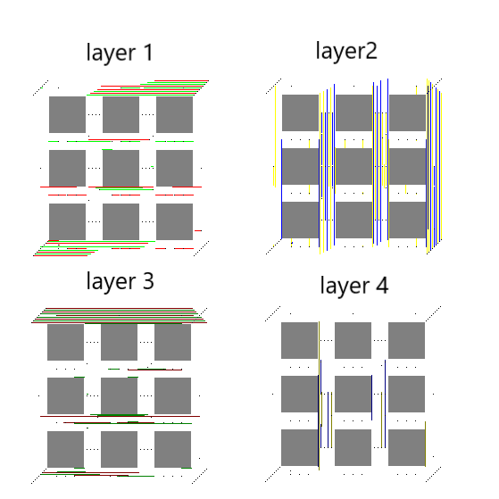
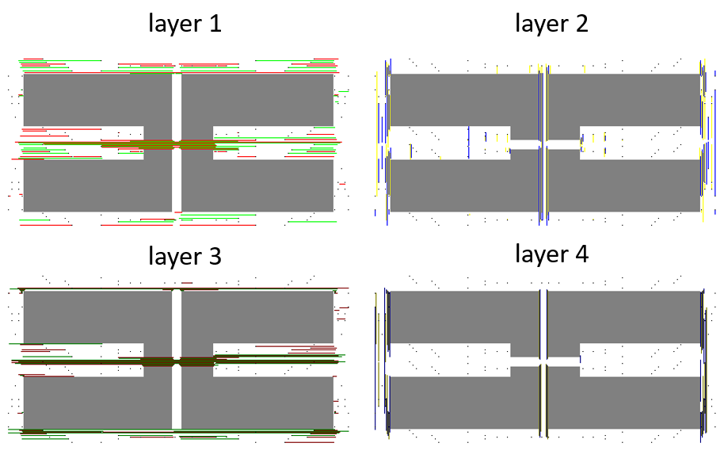

# Color-aware-Routing-for-Double-Patterning

## Task
This problem is from International Conference On Computer Aided Design(ICCAD) 2018.

Routing problem is a critical issue in circuit design. It is a practical problem in the real world .In this project, we need to route wires to connect the pins. Given the locations and layers of pins, locations of blockages, and netlist, we need to finish the routing that satisfies all requirements by using horizontal and vertical wires in different layers and color them appropriately. 

Requirements
1. All pins in a single net need to be connected (No open pins)
2. No wire across or contact any blockage
3. No color conflict (No short violation)
4. Only horizontal and vertical line
   
Color conflict:  
If the same color of wires are only separated by 0.5 grid.

Layer – Four metals:  
Metal 1 and 3 are horizontal wires. On the other hand, Metal 2 and 4 are vertical wires. 
|  Layer  | Layer No. | Pitch | Direction  |
| :-----: | :-------: | :---: | :--------: |
| Metal 1 |     1     |  0.5  | Horizontal |
| Metal 2 |     2     |  0.5  |  Vertical  |
| Metal 3 |     3     |  0.5  | Horizontal |
| Metal 4 |     4     |  0.5  |  Vertical  |
Each metal has two colors.

## Algorithms
### Main algorithms
Here we applied three algorithm in our solution. Each of them serves for the different step.
1. **Two-pins connecting** -> Hadlock algorithm  
2. **Multi-pins connecting** -> Minimum Spanning Tree by Prim's Algorithm 
3. **Coloring** -> Welsh-Powell Algorithm 

### Optimization
1. **Net Ordering** 
   We connect nets with smaller area first.
2. **Early stopping** 
   while we are doing Hadlock algorithm, if we meet the line of same net, we just simply connect it with the line.

### Complexity analysis
- Number of nodes: S
- Number of pins: P
- Width of map: W
- Number of Nets: N

1. Map initialization 
   - pins coloring: $O(P)$
   - blocks coloring: $O(S)$
2. Net connecting 
Minimum Spanning Tree by Prim's Algorithm
   - Initializtion: $O(S)$
   - Extract Min: $O(P^2logP)$
   - Hadlock's algorithm of every edge: $O(PSlogS)$
3. Coloring 
   $O(W+L)$
4. Total time complexity 
   $O(NP^2logp+NPSlogS)$

## Results
| Case  | Total  length | Critical  net  length | Vias  | Color  usage  layer 1 | Color  usage  layer 2 | Color  usage  layer 3 | Color  usage  layer 4 |
| :---: | :---------------: | :---------------------------: | :---: | :---------------------------: | :---------------------------: | :---------------------------: | :---------------------------: |
|   1   |       5306        |             1434              |  160  |         694 653.5         |        1382.5 1314        |          513 556          |          81 112           |
|   2   |       9316        |             2527              |  351  |       1402.5 1400.5       |          945 918          |       1507.5 1789.5       |        693.5 704.5        |

  Case 1 Layout                                 
 
  Case 2 Layout    

## Reference
1. [Maze Router: Lee Algorithm](http://users.eecs.northwestern.edu/~haizhou/357/lec6.pdf)
2. [Coloring](2.http://www.csie.ntnu.edu.tw/~u91029/Coloring.html)